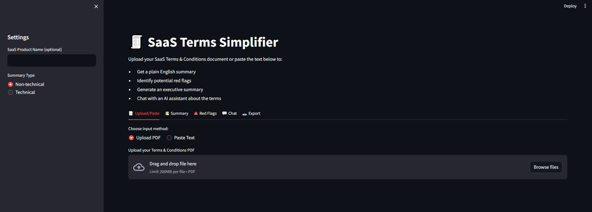

# 🧾 SaaS Terms Simplifier and Risk Analyzer Agent

A GenAI-powered legal assistant that translates complex SaaS Terms & Conditions into plain English, flags risks, and enables interactive understanding through summaries, structured output, and a chatbot.

## 🚀 Features

- 📝 User Input Ingestion (text/PDF)
- 🧾 Plain English Summarization
- 🚨 Red Flag Detection
- 📚 Executive Summary Generation
- 💬 FAQ Chatbot (RAG-powered)
- 📤 Downloadable Outputs (JSON/Markdown/PDF)
- 🧪 Evaluation Tools

---

## 📸 Demo Video (Click to view)

[](https://drive.google.com/file/d/1CEU3m9cmhDL4H57KUOp-8L7c6ATVqsAs/view?usp=sharing)

---

## 🛠️ Tech Stack

- 🧠 LangChain + Gemini 1.5
- 🐍 Python + IPython + Markdown
- 📄 JSON + Pandas
- 🎛️ Streamlit (UI)
- 🧪 BLEU/ROUGE scoring
- 🧠 Chroma (for embedding + retrieval)
- 📤 ReportLab (for PDF exports)

## 📦 Installation

1. Clone the repository:
```bash
git clone [repository-url]
cd saas-term-analyzer
```

2. Create and activate virtual environment:
```bash
python -m venv saas_term_env
.\saas_term_env\Scripts\activate  # Windows
source saas_term_env/bin/activate  # Linux/Mac
```

3. Install dependencies:
```bash
pip install -r requirements.txt
```

4. Run the application:
```bash
streamlit run app.py
```

## 📁 Project Structure

```
saas-term-analyzer/
├── app.py                  # Main Streamlit application
├── agents/
│   ├── summarizer.py       # Text summarization agent
│   ├── red_flag.py         # Risk detection agent
│   └── summary_gen.py      # Executive summary generator
├── utils/
│   ├── text_splitter.py    # Document chunking utilities
│   ├── output_parser.py    # Output formatting utilities
│   └── faq_bot.py          # RAG-powered chatbot
├── prompts/
│   ├── summarizer.txt      # Summarization prompts
│   └── red_flag.txt        # Risk detection prompts
└── requirements.txt        # Project dependencies
```

## 🤝 Contributing

Contributions are welcome! Please feel free to submit a Pull Request.

## 🚀 Future Improvements & Roadmap

* **Severity Scoring Integration**: Feed red flag content and executive summaries into the chatbot or a separate severity-assessment agent to classify issues by risk level (e.g., low, medium, high).
* **Contextual Red Flag Insights**: Enhance red flag explanations by providing legal context, precedents, or simplified examples to aid non-technical users.
* **Dynamic Summarization Modes**: Add options to toggle between different summary styles — concise, detailed, or legal-to-plain-English translations.
* **Multilingual Support**: Extend summarization and red flag detection capabilities to handle SaaS terms written in other languages.
* **Feedback Loop & Fine-Tuning**: Implement user feedback capture for summaries and risk flags to fine-tune Gemini responses over time.
* **Severity Visualizations**: Integrate simple data visualizations (e.g., pie charts, bar graphs) showing red flag types and their severity distribution.
* **Document Comparison Feature**: Allow users to upload and compare two SaaS agreements side-by-side to identify clause differences or risk deltas.
* **User Authentication & History**: Add login functionality and enable users to view/download previous analyses securely.
* **API Integration**: Package the backend as a REST API or LangServe-powered endpoint to enable external SaaS platforms to embed the agent.
* **Model Evaluation Benchmarks**: Introduce structured evaluation of summarization and red flag accuracy using gold-standard datasets or LLM-as-a-judge scoring.

## 📄 License

This project is licensed under the MIT License - see the LICENSE file for details. 
